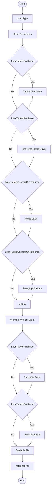

```mermaid
flowchart TB
    Start(["Start"])
    LoanType["Loan Type"]
    HomeDescription["Home Description"]
    d1{"LoanTypeIsPurchase"}
    TimeframeToPurchase["Time to Purchase"]
    d2{"LoanTypeIsPurchase"}
    FirstTimeHomeBuyer["First Time Home Buyer"]
    d3{"LoanTypeIsCashoutOrRefinance"}
    HomeValue["Home Value"]
    d4{"LoanTypeIsCashoutOrRefinance"}
    MortgageBalance["Mortgage Balance"]
    Military["Military"]
    WorkingWithAnAgent["Working With an Agent"]
    d5{"LoanTypeIsPurchase"}
    PurchasePrice["Purchase Price"]
    d6{"LoanTypeIsPurchase"}
    DownPayment["Down Payment"]
    CreditProfile["Credit Profile"]
    PersonalInfo["Personal Info"]
    End(["End"])
    d1--"Yes"-->TimeframeToPurchase
    d1--"No"-->d2
    d2--"Yes"-->FirstTimeHomeBuyer
    d2--"No"-->d3
    d3--"Yes"-->HomeValue
    d3--"No"-->d4
    d4--"Yes"-->MortgageBalance
    d4--"No"-->Military
    d5--"Yes"-->PurchasePrice
    d5--"No"-->d6
    d6--"Yes"-->DownPayment
    d6--"No"-->CreditProfile
    Start--" "-->LoanType
    LoanType--" "-->HomeDescription
    HomeDescription--" "-->d1
    TimeframeToPurchase--" "-->d2
    FirstTimeHomeBuyer--" "-->d3
    HomeValue--" "-->d4
    MortgageBalance--" "-->Military
    Military--" "-->WorkingWithAnAgent
    WorkingWithAnAgent--" "-->d5
    PurchasePrice--" "-->d6
    DownPayment--" "-->CreditProfile
    CreditProfile--" "-->PersonalInfo
    PersonalInfo--" "-->End

```