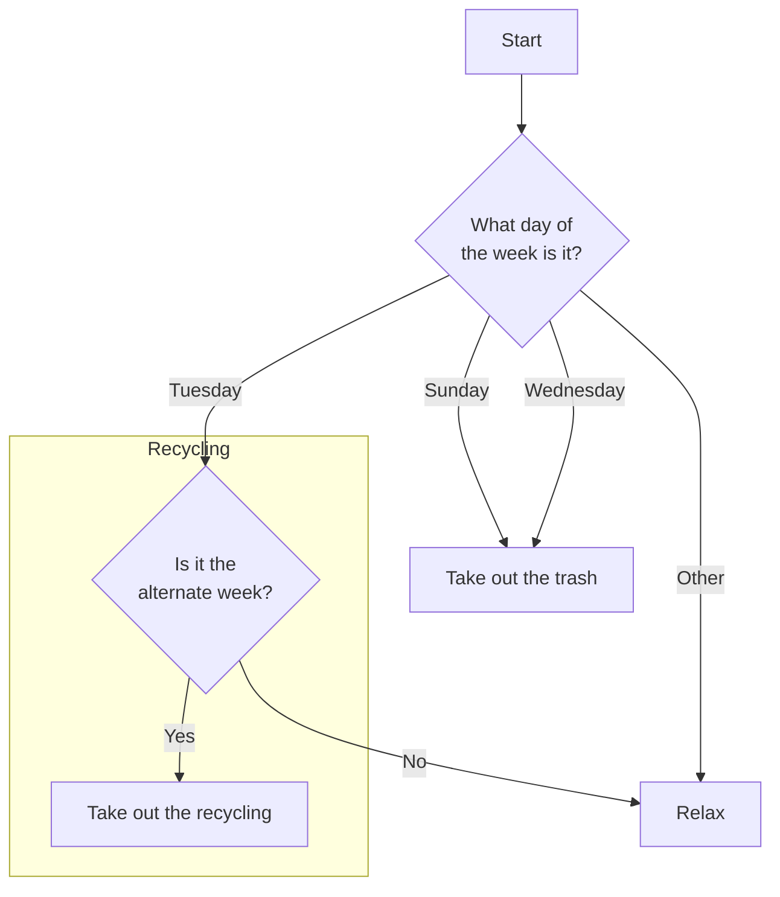

```mermaid
flowchart TB
    a1[Start]
    d1{What day of<br/>the week is it?}
    a2[Take out the trash]
    a4[Relax]
    subgraph b1[Recycling]
        d2{Is it the<br/>alternate week?}
        a3[Take out the recycling]
    end
    a1--" "-->d1
    d1--"Sunday"-->a2
    d1--"Tuesday"-->d2
    d2--"Yes"-->a3
    d2--"No"-->a4
    d1--"Wednesday"-->a2
    d1--"Other"-->a4

```