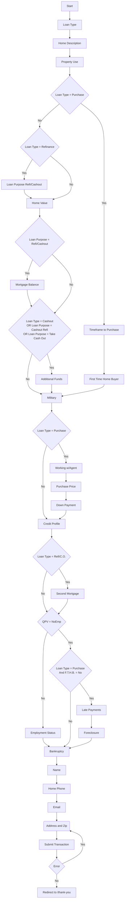

```mermaid
flowchart TD
    a0["Start"]
    a1["Loan Type"]
    a2["Home Description"]
    a3["Property Use"]
    d0{"Loan Type = Purchase"}
    a4["Timeframe to Purchase"]
    a5["First Time Home Buyer"]
    d1{"Loan Type = Refinance"}
    a6["Home Value"]
    a7["Loan Purpose Refi/Cashout"]
    d2{"Loan Purpose = Refi/Cashout"}
    a8["Mortgage Balance"]
    d3{"Loan Type = Cashout<br/>OR Loan Purpose = Cashout Refi<br/>OR Loan Purpose = Take Cash Out"}
    a9["Additional Funds"]
    a10["Military"]
    d4{"Loan Type = Purchase"}
    a11["Working w/Agent"]
    a12["Purchase Price"]
    a13["Down Payment"]
    a14["Credit Profile"]
    d5{"Loan Type = Refi/C.O."}
    a15["Second Mortgage"]
    d6{"QPV = NoEmp"}
    a16["Employment Status"]
    a17["Bankruptcy"]
    d7{"Loan Type = Purchase<br/>And F.T.H.B. = No"}
    a18["Late Payments"]
    a19["Foreclosure"]
    a20["Name"]
    a21["Home Phone"]
    a22["Email"]
    a23("Address and Zip")
    a24["Submit Transaction"]
    d8{"Error"}
    a25["Redirect to /thank-you"]
    a0--" "-->a1
    a1--" "-->a2
    a2--" "-->a3
    a3--" "-->d0
    d0--"Yes"-->a4
    d0--"No"-->d1
    a4--" "-->a5
    a7--" "-->a6
    a8--" "-->d3
    d1--"Yes"-->a7
    d1--"No"-->a6
    a6--" "-->d2
    d2--"Yes"-->a8
    d2--"No"-->d3
    d3--"Yes"-->a9
    d3--"No"-->a10
    a9--" "-->a10
    a5--" "-->a10
    a10--" "-->d4
    d4--"Yes"-->a11
    d4--"No"-->a14
    a11--" "-->a12
    a12--" "-->a13
    a13--" "-->a14
    a14--" "-->d5
    d5--"Yes"-->a15
    d5--"No"-->d6
    a15--" "-->d6
    d6--"No"-->a16
    a16--" "-->a17
    d6--"Yes"-->d7
    d7--"No"-->a17
    d7--"Yes"-->a18
    a18--" "-->a19
    a19--" "-->a17
    a17--" "-->a20
    a20--" "-->a21
    a21--" "-->a22
    a22--" "-->a23
    a23--" "-->a24
    a24--" "-->d8
    d8--"Yes"-->a23
    d8--"No"-->a25

```